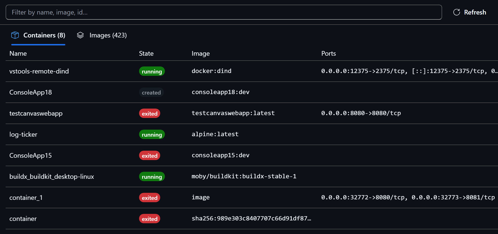

# Containers for Copilot

A Copilot canvas for local Docker: browse and operate containers and images in
a panel instead of reading command output.

Open it by asking Copilot about your containers — "what's running?", "why did
`web` stop?", "what do the logs for `api` say?" — or open the **Containers**
canvas directly.



## What it does

| View | What it is for |
| --- | --- |
| **List** | Containers and images, sortable and filterable, with lifecycle controls. |
| **Logs** | Live `--follow` streaming with filtering, adjustable tail, copy and save. |
| **Stats** | CPU, memory and network as sparklines, sampled about once a second. |
| **Files** | Browse a container's filesystem, read files, and open one in the Copilot editor. |
| **Terminal** | An interactive shell with a real PTY. *(optional, see below)* |
| **Commands** | Run one-off commands and keep an auditable record of what ran. |
| **Layers** | Which layer made an image large, in build order. |
| **Dockerfile** | The recorded source repository, plus a labelled reconstruction. |
| **Run image** | Start a container from an image with validated options. |

Images can also be pulled and tagged from the panel.

Copilot can drive all of it, and everything it runs is visible in the panel.

### How Copilot decides to open it

The plugin ships a skill (`skills/containers-canvas/SKILL.md`) that routes
container questions to this panel. Without it the canvas only opens when the
agent happens to choose it from the canvas description; with it, asking "why did
`web` stop?" reliably lands on that container's logs rather than producing pasted
`docker logs` output.

The skill also carries the deep-link mapping — which `view` answers which kind of
question — and what to do if the canvas fails to register. Its YAML frontmatter
description is what the agent matches against, so edit it with care: it states
what the panel is *for* and, just as importantly, what it is not for.

One gotcha if you edit it: the description must stay quoted. An unquoted `: `
anywhere in it is parsed as a YAML mapping and the skill silently fails to load.
`copilot skill list` reports the parse error.

### Staying current

The panel tracks the daemon rather than a snapshot, so changes made anywhere —
another terminal, an IDE, a compose run, or Copilot itself — appear without
being asked for. Typical latency is one to three seconds.

Two mechanisms, deliberately unequal:

- **`docker events`** does the work. One stream is shared by every open panel.
- **A 10-second poll** is only a safety net, for what a stream cannot report:
  a dropped connection, a daemon restart, a machine resuming from sleep.

The poll is built to be cheap and quiet. It compares containers alone —
measured at ~250 ms, against ~2.5 s for a full load on a machine with a few
hundred images — and reads through the humanised uptime in `Status` so that
"Up 5 minutes" ticking to "Up 6 minutes" is not mistaken for a change. When the
event stream has just reported something, the poll stays silent rather than
reloading the same change twice. On an idle machine it produces no work at all.

Reloads are also scoped and quiet: a container event reloads containers only,
since it cannot have changed the image list, and a reload reaches the UI only
when a rendered field actually moved. Actions the canvas itself causes —
`docker exec` for the terminal, `docker cp` for file browsing — are ignored, so
opening a folder does not make the panel reload itself.

## Install

Three routes, all currently supported. Nothing here replaces anything — pick
whichever fits.

**From this repository's catalog** (preferred; the only one that is not
deprecated):

```
copilot plugin marketplace add microsoft/vscode-containers
copilot plugin install containers@vscode-containers
```

`marketplace add` reads the catalog from the repository's default branch, so
this works once the plugin has landed on `main`. Before then, point it at a
local clone instead — a local path is read from the working tree, so it follows
whatever branch you have checked out:

```
copilot plugin marketplace add <path to your clone>
copilot plugin marketplace update vscode-containers   # after switching branches
```

A local-path install loads the plugin live from the clone rather than copying
it, so edits take effect on the next session.

**Directly from a folder or URL**, which still works but prints a deprecation
warning — the CLI intends to support only `plugin@marketplace` in future:

```
copilot plugin install <path to a copy of extensions/containers-canvas>
```

Copy the folder out of the git working tree first. Installing from a path
inside a checkout fails with `Access is denied (os error 5)`.

**From the public catalog** — not yet available. Listing in `awesome-copilot`
requires the plugin to be on `main` and tagged:

```
copilot plugin install containers@awesome-copilot
```

Whichever route you use, start a new Copilot session afterwards — plugin
extensions are discovered at session start, not by reloading extensions.

### Optional: the interactive terminal

Everything above works out of the box. The **Terminal** view additionally needs
a native package, because `docker exec -it` will not accept piped stdin and
needs a real PTY:

```
cd <installed plugin>
npm install --omit=dev @lydell/node-pty
```

`--omit=dev` matters: this package.json is also the workspace build manifest, so
a plain `npm install` pulls the 13 devDependencies esbuild needs and gets you
104 packages instead of 2. Those are build-time only and nothing at runtime
imports them.

Note the path is the plugin root, not the `com.github.copilot/...` directory
inside it: Node resolves `node_modules` upward from the file doing the import,
and that file sits at the root.

Without it the terminal reports that it is unavailable and nothing else is
affected. The **Commands** view covers most one-off use without a PTY.

## Safety

This canvas can start containers, remove them, and run commands inside them, so
the boundaries are worth stating plainly.

- **Commands are argv, never a shell string.** They are passed straight to
  `execFile`, so `;`, `|`, `>` and globs are literal arguments. There is
  nothing to inject into.
- **Mounts are checked.** `docker run` refuses to bind-mount drive roots,
  system directories or the container runtime socket.
- **Containers that are not isolated are refused.** A privileged container, or
  one mounting the daemon socket, is effectively the host — running a command
  there requires an explicit acknowledgement.
- **Everything Copilot runs is recorded** in the Commands view, with argv,
  exit status, duration and full output.
- **Web pages cannot reach the panel.** Each panel talks to a short-lived
  loopback server. Requests carrying a foreign `Origin` or `Sec-Fetch-Site` are
  refused on every route, `/rpc` requires `application/json` so a cross-origin
  request has to be preflighted, and the terminal WebSocket is checked at the
  upgrade.

Containers started by this canvas are labelled `copilot.canvas` so they can
always be told apart from your own.

### What Copilot is allowed to do

Worth being precise, because "the agent can only read" would be untrue. Copilot
can **remove containers and images** (`remove` and `forceRemove`), start and
stop them, run commands inside them, pull and tag images, and create containers
from an image.

It cannot prune. Bulk deletion is not exposed at all, to the agent or the UI.

The panel shows every action, and removal of a container you did not create is
still removal — treat this the way you would treat giving a tool your docker
socket, because that is effectively what it is.

## Requirements

- Docker on `PATH`, with a reachable daemon
- Copilot CLI 1.0.79 or later — plugins can ship canvas extensions from 1.0.79

Podman is detected if Docker is absent, and the basics work, but it is not
supported: several outputs are parsed differently by Podman and image
provenance has no Podman equivalent. Treat it as unverified.

## Development

**Read [`docs/constraints.md`](docs/constraints.md) before changing the build,
the packaging layout, the shipped `package.json`, or anything under `bundle/`.**
It states the portability contract this package has to satisfy and records, with
its incident and fixing commit, every rule that otherwise looks arbitrary. Most
of them exist because something shipped broken once.

```
cd extensions/containers-canvas
pnpm install                              # from the repo root
pnpm --filter containers-canvas build     # produces bundle/
pnpm --filter containers-canvas test      # pure unit tests, no daemon required
```

`bundle/` is committed so the package installs without a build step. It is not called `dist/` because the extension packaging flow drops a directory by that name as regenerable build output.

Because it is committed, it can go stale — and staleness is invisible. Edit a
source file, forget to rebuild, and every gate stays green: the unit tests pass
because they import `src/`, lint passes, and `git status` shows only the source
as modified. Users installing from that commit run the previous bundle, and the
repository describes behaviour the shipped code does not have.

`scripts/verifyBundle.mjs` closes that. It runs as the `package` script, which
the shared CI template runs directly after `build`, and fails if `bundle/` or
`NOTICE.html` differ from the commit. It reports untracked generated files too,
which is the more dangerous direction: a chunk that exists locally but was never
committed is simply missing for everyone else. Outside a git checkout it skips
rather than fails, since an installed plugin is not a repository.

If it fails locally, you have generated output that is not committed yet —
commit the rebuilt files.

The webview is code-split rather than emitted as one file. That is not a
performance choice: the extension installer rejects any file larger than 1 MB,
and a single bundle came to 1.35 MB — it installed and then failed to load. The
views load on demand, which keeps every emitted file well under the ceiling
(largest is ~600 KB) and keeps xterm out of first paint. **Check `pnpm build`
output sizes before folding a view back into the main entry point.** Rebuild it
after changing anything under `src/`, `server.mjs` or `execSessions.mjs`.

Dependency versions are pinned here rather than taken from the workspace
`catalog:`, unlike the other packages in this repo. This `package.json` ships to
users inside the plugin, and `catalog:` is a pnpm protocol that npm cannot
parse — anyone running `npm install @lydell/node-pty` to enable the terminal
would hit `EUNSUPPORTEDPROTOCOL`.

That is not a rule anyone has to remember: `scripts/verifyManifest.mjs` runs
first in the build and fails it if any dependency specifier uses a protocol npm
cannot resolve. It checks `devDependencies` too, because npm parses every
dependency field before deciding what to install — `--omit=dev` does *not* save
a user from a `catalog:` entry it was never going to install.

This one file serving both pnpm and users is the underlying awkwardness. A
plugin installs from a git ref with no build step, so the source manifest is the
shipped manifest and there is no artifact to strip dev fields from. The cost is
the `--omit=dev` footnote above. The full fix is to separate the plugin root
from the workspace package so the build can emit a minimal runtime manifest;
that is a layout change, not a tweak, and it would mean re-verifying every
install route.

`typescript` is declared even though nothing here is TypeScript. `@trpc/server`
has a required peer of `typescript >=5.7.2`, and without an explicit version
pnpm satisfies it with the TypeScript 7 the repo root installs under the
`@typescript/native` alias. That compiler has no API, so typescript-eslint
silently loses type information and `pnpm -r lint` fails across the whole
repository — see the note in `pnpm-workspace.yaml`. Pinning it to the same
version typescript-eslint uses keeps that resolution stable. Removing it
re-breaks linting for every package, not just this one.

## Contributing

This project welcomes contributions and suggestions. Most contributions require you to agree to a
Contributor License Agreement (CLA) declaring that you have the right to, and actually do, grant us
the rights to use your contribution. For details, visit https://cla.opensource.microsoft.com.

When you submit a pull request, a CLA bot will automatically determine whether you need to provide
a CLA and decorate the PR appropriately (e.g., status check, comment). Simply follow the instructions
provided by the bot. You will only need to do this once across all repos using our CLA.

### Code of Conduct

This project has adopted the [Microsoft Open Source Code of Conduct](https://opensource.microsoft.com/codeofconduct/).
For more information see the [Code of Conduct FAQ](https://opensource.microsoft.com/codeofconduct/faq/) or
contact [opencode@microsoft.com](mailto:opencode@microsoft.com) with any additional questions or comments.

## Telemetry

This canvas collects nothing and sends nothing. It shells out to your local
container runtime and renders what comes back; there is no reporting endpoint
in the code. The host application it runs inside has its own telemetry policy,
which is unaffected by this plugin either way.

## Third-party notices

`NOTICE.html` is generated by the build, not maintained by hand. The repository's
root notice describes the VS Code extension's dependencies; this package bundles a
different set — React, Fluent UI, xterm, tRPC, ws and zod are compiled into
`bundle/`, which is committed and installed with no build step, so those licences
have to travel with it.

The generator reads esbuild's metafiles and attributes only what actually
contributed bytes to the output. That is narrower than `package.json` in both
directions: build tools like `esbuild` and `typescript` never ship, transitive
packages like `scheduler` do, and code that tree-shaking removed is left out —
importing one component from the Fluent barrel parses a carousel library that
contributes nothing, and claiming to redistribute it would be its own kind of
inaccuracy.

A bundled package with no readable licence file **fails the build**. The only way
past that is an explicit, commented entry in `LICENCE_OVERRIDES`, which exists so
those judgement calls are visible and reviewable rather than buried. There is one
today, documented in place.

## Trademarks
This project may contain trademarks or logos for projects, products, or services. Authorized use of Microsoft
trademarks or logos is subject to and must follow
[Microsoft's Trademark & Brand Guidelines](https://www.microsoft.com/en-us/legal/intellectualproperty/trademarks/usage/general).
Use of Microsoft trademarks or logos in modified versions of this project must not cause confusion or imply Microsoft sponsorship.
Any use of third-party trademarks or logos are subject to those third-party's policies.

Docker and the Docker logo are trademarks or registered trademarks of Docker, Inc.

## License

[MIT](LICENSE.md). Copyright (c) Microsoft Corporation.
